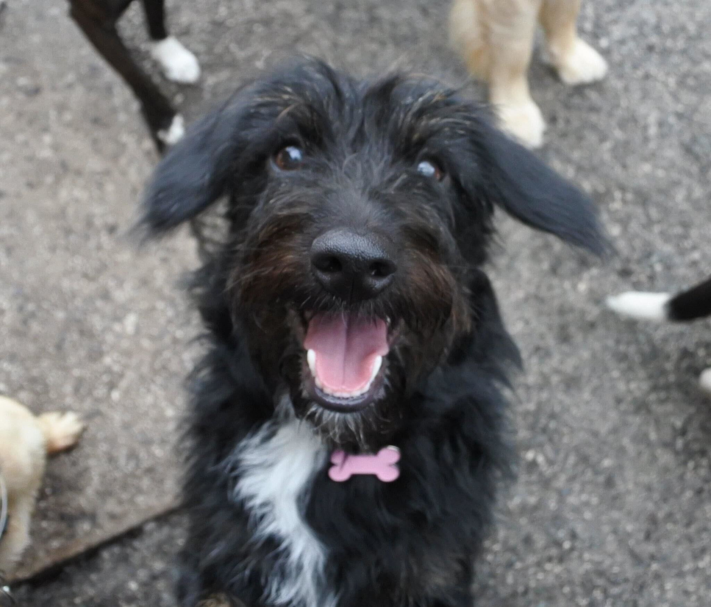

---

title: Weeks Notes - First week at GDS!
date: 2022-08-08
author: Joe Roberts <joe@twofirstnames.org>
draft: false

---

Just over a month since my last post? Oh dear!

Well, internet, I'm yet again trying to get into the habit of posting week notes, so I hope you enjoy them!

The format I'm going for is as the week progresses, I'll update the current week's notes. I'll try my best to keep on top of it, and of course some days won't have anything that interesting, but we'll see!

# Monday

So yeah! I joined GDS, the Government Digital Service, part of the Cabinet Office in the UK Government. I'm a Civil Servant now, that's terrifying. GDS work to bring services and standards that benefit the whole of the government, and by extension the public. Examples range from a notifications platform for sending SMS and email, to an identity platform for providing a single experience for logging into government service.

My first day was about as thrilling as one might expect. Everyone is really welcoming though and I'm definitely going to enjoy it! Outside of the usual onboarding fun times, I've managed to sneak my way into a few team meetings, I have at least an idea of what I'm up against now.

Outside of the immediate work sphere, I've joined a few networks and club in and around GDS; like the LGBT network, the SRE Community and the dog club! I think posting a few pics of Peggy made me an instant favourite.

Overall it was exciting, new job and all that, and so many new faces!

# Tuesday

Slowly starting to get into a routine, which is nice. I attended my first stand-up, of course not much to say, but met the members of my team and introduced myself. It's nice to put names to faces. :)

Over the course of today, I had a few other meetings with the wider team, one had over a hundred people in it! It was all very informal and enjoyable, really finding myself getting into the team.

To cap off the day, I attended a lightning talk on Rust and why it isn't a C replacement. It was super informative and I'll try to link to it if it was recorded and available online.

# Wednesday

Half way through the week! 🎉 Honestly, this is just so exciting for me!

I've got a load of team meetings coming up, mostly discussing our Ways of Working and refining the backlog. Fun stuff! It'll help for alignment across the team which is good.

On more interesting things, GDS had their monthly SRE Community meeting today, which was super interesting! People are, as always, really nice and there was lots of good discussion. It's so good to see I have a community backing me from across GDS while I'm working on my team.

# Thursday

My first day in the office! It was hot! 🔥🔥🔥 Far too hot. Peggy spent the day in daycare, so at least she had aircon and a paddling pool, only a bit jealous.

But it was nice to get out, travel and chill on the tram. The office is really lovely, we share it with NICE and a couple other government departments/NGO -- so it's pretty big! I got a tour of the building as part of my induction, including the backstage areas; even got to see the HVAC up close!

Despite being in the office, my day was pretty much normal; didn't really have too many meetings at least. I did go to the opticians, and spent far too long there, but got some snazzy new glasses out of it, I'll get them in two weeks and they'll definitely take some getting used to!